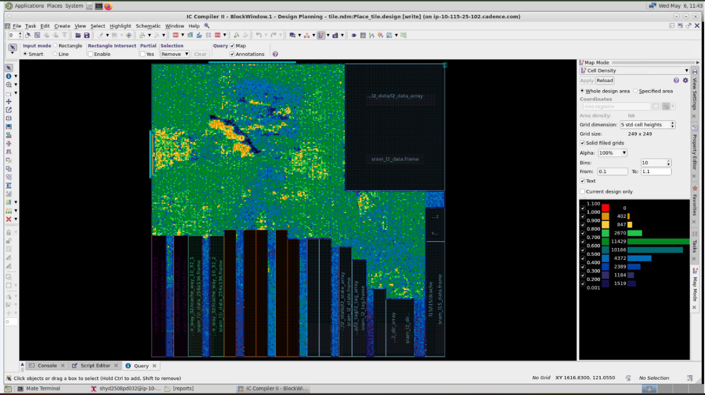
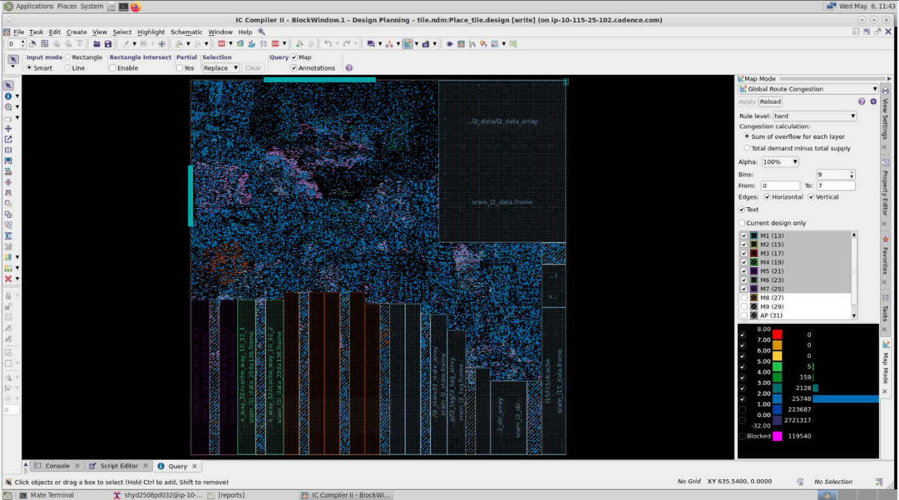
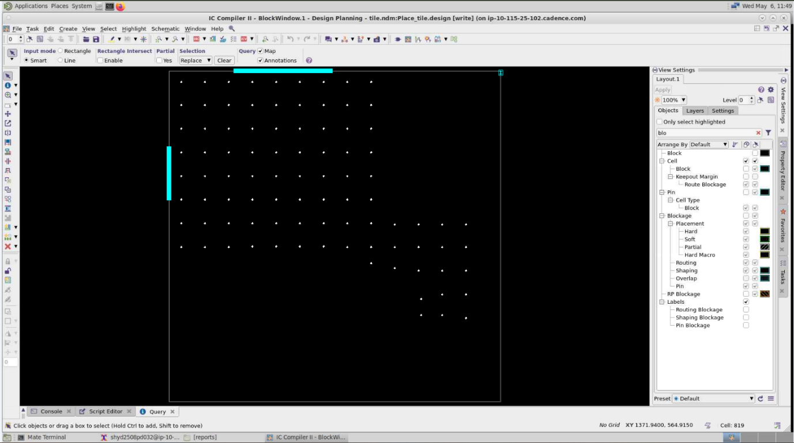
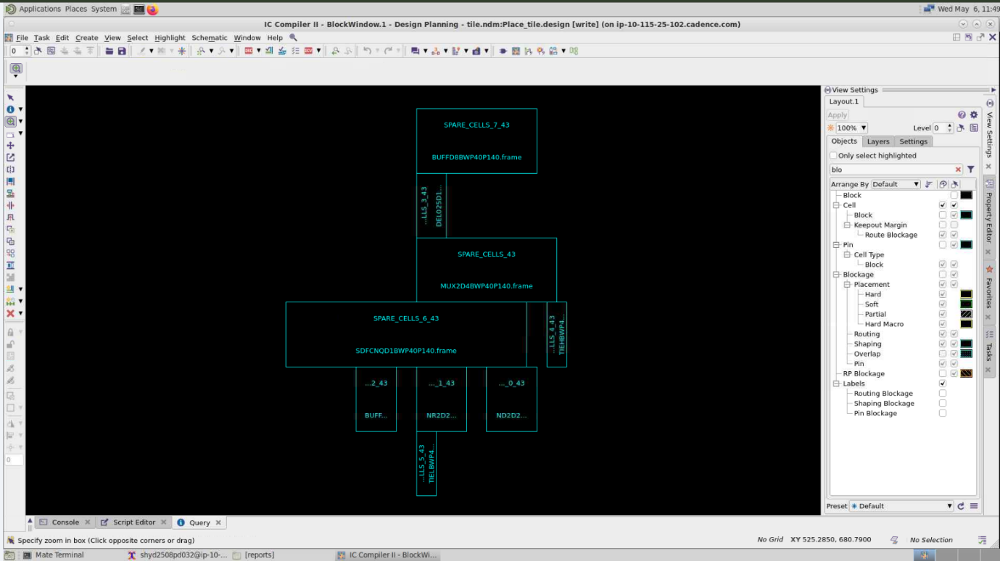

# Placement

## Tool

Synopsys ICC2

## Objective

Place the standard cells within the defined floorplan while maintaining acceptable utilization, congestion, legality, and timing.

## Placement Metrics

| Metric | Value |
|---|---:|
| Core Utilization | 77.62% |
| Congestion | 0.91 H% / V% |
| Spare Cells Inserted | Yes |
| Number of Spare Cells | 819 |

## Placement Checks

- Placement legality check completed successfully
- Cell density checked
- Congestion analyzed
- Setup timing analyzed across major path groups
- Maximum transition violations: 0
- Maximum capacitance violations: 0
- Spare cells inserted successfully

## Setup Timing

| Path Group | WNS (ns) | TNS (ns) | FEP |
|---|---:|---:|---:|
| REG-to-REG | -0.27 | -311.69 | 1120 |
| IN-to-REG | -0.29 | -110.52 | 1461 |
| REG-to-OUT | -0.34 | -166.09 | 785 |
| IN-to-OUT | 0 | 0 | 0 |

## Analysis

Placement analysis included cell density and congestion evaluation along with timing analysis across different path groups.

Spare cells were inserted as part of the placement stage.

## Outcome

The placement stage was completed with legal placement, acceptable congestion, zero maximum-transition violations, and zero maximum-capacitance violations.     

## Placement Visualization

### Cell Density

### Congestion

### Spare Cell Distribution

