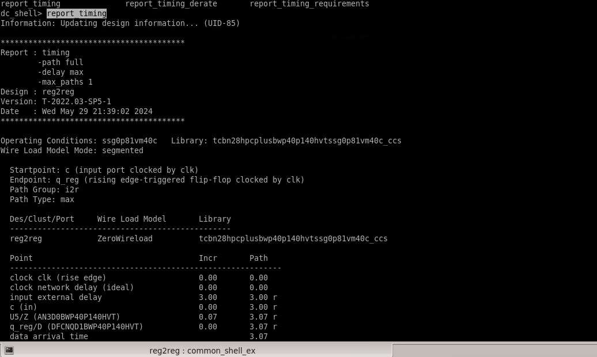

# Timing Analysis

## Tool

Synopsys Design Compiler

## Objective

Analyze the timing behavior of the synthesized design and identify timing paths that meet or violate the specified constraints.

## Timing Analysis

The `report_timing` command was used to analyze timing paths in the design.

The timing report provides information about:

- Timing slack
- Timing violations
- Critical timing paths
- Path delays
- Timing requirements



## Slack Analysis

Slack represents the timing margin available on a path with respect to the specified timing requirement.

- Positive slack indicates that the timing requirement is met.
- Negative slack indicates a timing violation.

## Timing Checks

The project included timing checks after synthesis and constraint application using:

```tcl
check_timing
```

Detailed timing analysis was performed using:

```tcl
report_timing
```

## Path Analysis

Timing paths were analyzed to identify critical paths and understand their timing behavior under the applied constraints.

## Outcome

Timing reports were generated for the synthesized design, providing visibility into critical paths, slack, and potential timing violations.
